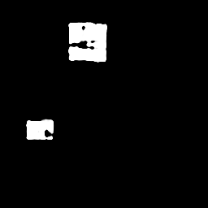

# Segmentation

## ※ Defect Detection에 필요한 Segmentation 학습 방법론, Augmentation 익히기

Example: 원본 , 정답 , 예측

                                   
   
      
---

## Overview

Key Point 

(1) Imbalance(Defect/Background 면적비) , Low Contrast Image 검출 을 위한 Augmentation 

(2) 학습 단계에 따른 Loss function 선택?

### Augmentation

 (1) 첨부 된 make_image.py 를 이용하여 Train/Test Data를 생성 
 (2) Test Data : Defect 1~2개 , Contrast 3~4 Gray 차이 (위 Example Image )
 (3) Train Data : make_image.py 를 이용하여 Train Data를 생성, 어떻게 생성해야 Train 되고 Test Set이 검출이 되는지 Study
 
```python

import numpy as np
import os
import cv2 as cv


for image_num in range(0,100):
    data = np.random.randint(100,125, size = 256*256 , dtype = np.uint8)
    data = np.reshape(data, (256,256))
    label_data = np.zeros((256,256), dtype = np.uint8)
    
    for defect_num in range(1,3):
        size_x = np.random.randint(8,64, size = 1 , dtype = np.uint8)
        size_y = np.random.randint(8,64, size = 1 , dtype = np.uint8)
        x = np.random.randint(0,256-size_x[0], size = 1 , dtype = np.uint8)
        y = np.random.randint(0,256-size_y[0], size = 1 , dtype = np.uint8)
        defect_contrast = np.random.randint(3,4, size = 1 , dtype = np.uint8)
        
        
        for col in range(x[0], x[0]+size_x[0]):
            for row in range(y[0],y[0]+size_y[0]):
                data[row][col] = np.random.randint(100 + defect_contrast[0],125 + defect_contrast[0], size = 1 , dtype = np.uint8)
                label_data[row][col] =255
        
     
    cv.imwrite("D:/WORKPLACE/make_image/test/" +str(image_num) + ".png",data)  
    cv.imwrite("D:/WORKPLACE/make_image/test/label/" +str(image_num) + ".png",label_data)    
```    
    
### 기초 코드

 (1) 첨부 된 Keras train.py, model.py 를 이용
 (2) 'binary_crossentropy' , [dice_coef_loss] 둘 중 어떤 Loss function을 어떻게 이용할지 평가
 
 
### 목표 
 
 (1) 여러가지 Network 평가 해보기 : Inline 검사용 Segmentation Network 설계
     
 (2) 일단 학습 및 검출이 되도록 해보기 

 (3) Sigle/ Batch Inference 속도 비교
 
 --- 
